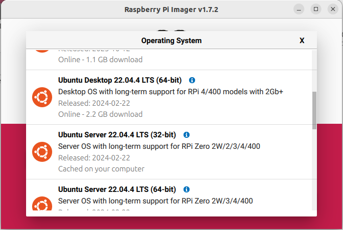
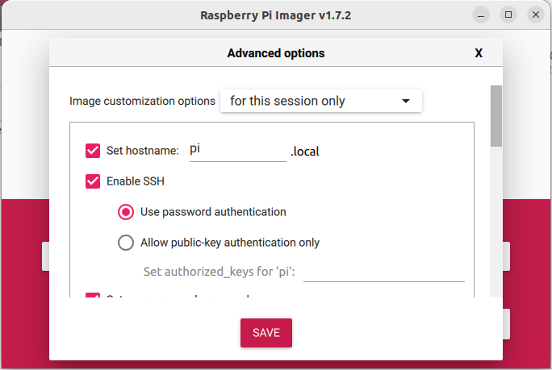
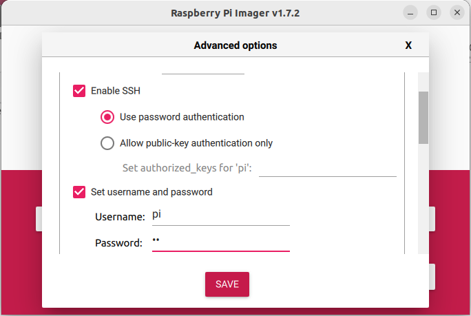
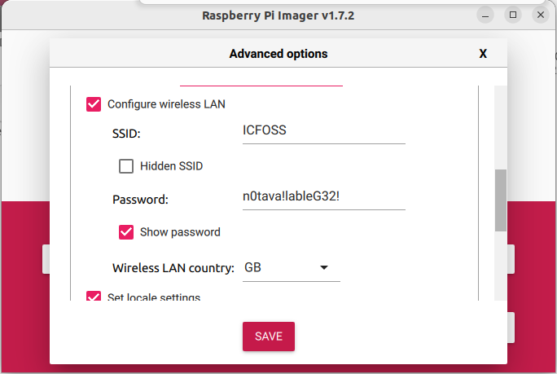

# Acoustic Rain Gauge Setup Guide

## Hardware Setup
- Use Raspberry Pi 4 as board 
- Insert SD Card
- Connect USB Microphone and LAN
- Connect Davis to GPIO pin number 13 and ground (optional)

## Software Setup
### 1. Install Ubuntu Server 22.04.4 LTS (64-bit) using **Raspberry Pi Imager** Software


### 2. Enable SSH Settings, give user credentials and WiFi credentials




### 3. Flash the operating system and boot the Raspberry Pi

### 4. Check IP is getting assigned in Ethernet and Wifi

```bash
ip -br a
```
Both Ethernet and Wifi should be UP and IP should be assigned

### 5. Update and upgrade OS

```bash
sudo apt update
sudo apt upgrade
sudo reboot
```

### 6. Download and run setup.sh for automating environment setup

```bash
# Download setup.sh
wget 'https://raw.githubusercontent.com/cksajil/rainfall_monitor/deployment/setup.sh'

# run setup.sh
bash setup.sh
```

### 7. Check in command line if microphone is detected
```bash
lsusb
```
This will list out all the USB devices connected to Raspberry Pi. To make sure that microphone is getting detected run the above command without connecting microphone and see the output. Repeat the same after connecting the microphone. Now the microphone or soundcard name should appear in the list as an additional entry.

### 8. Check if $arecord$ command lists the input devices
```bash
arecord -l
```

### 9. Reboot the Raspberry Pi
```bash
sudo reboot
```

### 10. After rebooting check if $arecord$ command is working
```bash
# Records a 5 second test audio as wav file
arecord --duration=5 sample.wav

# Delete the test file
rm sample.wav
```

### 11 Connect and Setup RFM95 Module to Raspberry Pi 4
#### Hardware mapping 

The complete WiringPi pin mapping can be seen [here](https://raw.githubusercontent.com/cksajil/LoraWANPi/main/lmic_rpi/raspberry_pi_wiring_gpio_pins.png) 
| WiringPi Pin | Function        |
|--------------|-----------------|
| 0            | Reset           |
| 4            | DIO0            |
| 5            | DIO1            |
| 1            | DIO2 (Not used) |
| 12           | MOSI            |
| 13           | MISO            |
| 14           | SCK             |
| 6            | SS              |
| 2            | STATUS LED      |
| 3            | DATE SENT LED   |
| GND          | GND             |
| 3.3V         | +3.3V           |

#### Install the WiringPi library 

The [WiringPi](https://github.com/WiringPi/WiringPi) library provides the Raspberry Pi GPIO interface. Follow the instructions in that repository or do the following.

```bash
# Clone the repository 
$ git clone https://github.com/WiringPi/WiringPi.git 

# Access the wiringPi folder 
$ cd wiringPi 

# Build the library
$ ./build 
```

#### Compile [LoraWANPi](https://github.com/lucasmaziero/lmic-rpi-fox.git) 

```bash
# Access the lmic_rpi folder 
$ cd lmic_rpi/examples/ttn-abp-send 

# Make the project 
$ make 

# Running the program 
# This will generate the executable for LoraWAN communication
$ ./ttn-abp-send 
```

### 12. Add influx-db yaml file (`influxdb_api.yaml`) or LoraWAN keys yaml file (`lorawan_keys.yaml`) to config folder

### 13. Add the device to Zerotier account

Follow the instructions on [Zerotier for Raspberry Pi Tutorial](https://pimylifeup.com/raspberry-pi-zerotier/). Go to  [Zerotier](https://my.zerotier.com/) platform and login with the credentials shared via email/open project to monitor/connect to device IPs.

### 14. Add Python scripts to bashrc file  

```bash
nano ~/.bashrc

# Appened the following line to the end of .bashrc file 
python3 /home/pi/raingauge/code/daq_pi.py

# Reboot the device
sudo reboot
```


